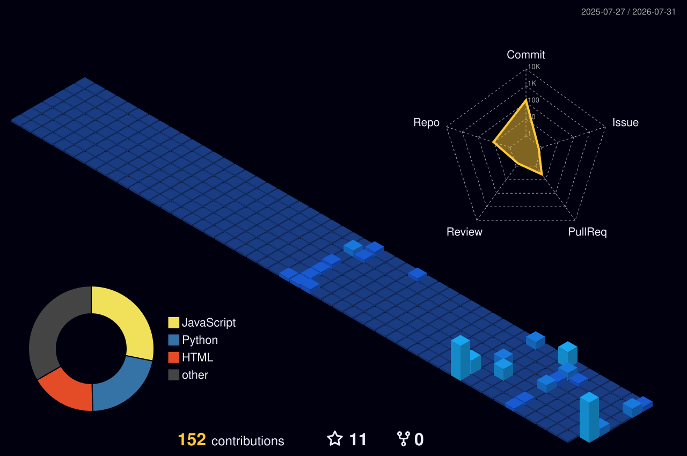

  

 

  <h2>👨‍💻 System.out.println("Sobre Mim");</h2>
  

    Sou um Desenvolvedor apaixonado por arquitetar soluções, desde a criação de interfaces modernas e reativas (<b>Glassmorphism & UX/UI</b>) até a lógica de sistemas complexos.  
    Estudante de Ciência da Computação (PUC Minas), movido pela curiosidade de entender como as coisas funcionam por baixo dos panos — seja no desenvolvimento web ou explorando estruturas de jogos clássicos.
  

  
  <table align="center">
    <tr>
      <td align="center">
        🎯 <strong>Objetivo Atual: Estágio / Vaga Jr. em Desenvolvimento FullStack.</strong> 
        <i>Busco integrar um ecossistema tech dinâmico para entregar código limpo, otimizado e focado em resolver problemas reais, enquanto evoluo tecnicamente junto com a equipe.</i>
      </td>
    </tr>
  </table>

 

<h2 align="center">🚀 Stack Tecnológico</h2>

  

 

<h2 align="center">🏆 Projetos em Destaque</h2>

<table align="center" width="100%">
  <tr>
    <td width="50%" valign="top">
      <h3>🃏 <a href="https://yu-gi-oh-forbidden-memories-psx.vercel.app/" target="_blank">Yu-Gi-Oh! Forbidden Memories</a></h3>
      

        <b>Banco de Dados interativo para o clássico de PS1.</b> 
        Engenharia focada na extração e exibição de dados complexos. Conta com todas as 722 cartas, sistema de buscas instantâneas, filtros dinâmicos e painel holográfico de <i>drops</i> e <i>rates</i>. Desenvolvido com uma interface <i>Glassmorphism</i> imersiva.
      

      

        
        
        
      

      

        🔗 <a href="https://yu-gi-oh-forbidden-memories-psx.vercel.app/" target="_blank"><b>Live Demo</b></a> | 
        📁 <a href="https://github.com/WagnerxOliveira/projeto-yu-gi-oh-forbidden-memories" target="_blank"><b>Repositório</b></a>
      

    </td>
    <td width="50%" valign="top">
      <h3>🔤 <a href="https://secret-word-mu-three.vercel.app/" target="_blank">Secret Word Game</a></h3>
      

        <b>Jogo reativo de dedução e lógica.</b> 
        Aplicação focada em manipulação de estado complexo e renderização condicional. O jogo testa o vocabulário do usuário com geração dinâmica de palavras e uma interface que reage em tempo real aos inputs e tentativas do jogador.
      

      

        
        
        
      

      

        🔗 <a href="https://secret-word-mu-three.vercel.app/" target="_blank"><b>Live Demo</b></a> | 
        📁 <a href="https://github.com/WagnerxOliveira/secret_word" target="_blank"><b>Repositório</b></a>
      

    </td>
  </tr>
</table>

 

<h2 align="center">📊 Terminal de Contribuições & Analytics [Status: Online]</h2>

<!-- 1. Cards de Resumo (Linguagens e Commits - Referência: vn7) -->

  <h3>⚡ Visão Geral do Repositório</h3>
  
    
  
  

 

<!-- 2. Gráfico 3D -->

  <h3>🌌 Contribuições 3D & Radar de Produtividade</h3>
  <picture>
    
  </picture>

 

<!-- 3. WakaTime & Hábitos de Código (Seu Dashboard Cyberpunk) -->

  <h3>🕒 Hábitos & WakaTime Real-Time</h3>
  

 

<!-- 4. Animação da Cobra -->

  <h3>🐍 Algoritmo de Contribuição</h3>
  <picture>
    <source media="(prefers-color-scheme: dark)" srcset="https://raw.githubusercontent.com/WagnerxOliveira/WagnerxOliveira/output/github-contribution-grid-snake-dark.svg">
    <source media="(prefers-color-scheme: light)" srcset="https://raw.githubusercontent.com/WagnerxOliveira/WagnerxOliveira/output/github-contribution-grid-snake.svg">
    
  </picture>

 

  
<em>Sistemas de monitoramento atualizados via automação YAML CI/CD ⚙️</em>

 

<h2 align="center">📫 Inicializar Conexão</h2>

  <i>Pronto para transformar café e ideias em soluções reais. Vamos conversar?</i>

  
  
  

---

  <em>Desenvolvido e codificado por <b>Wagner Oliveira</b> 👾</em>

